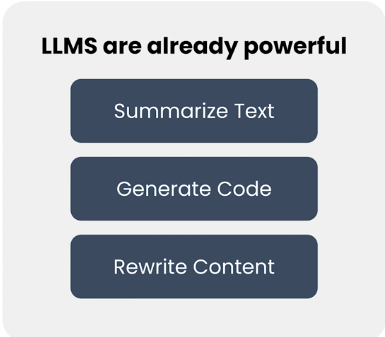
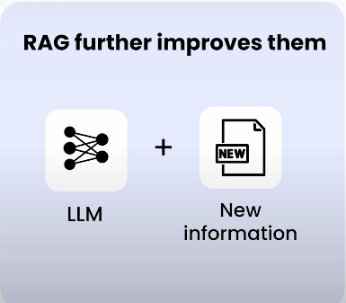
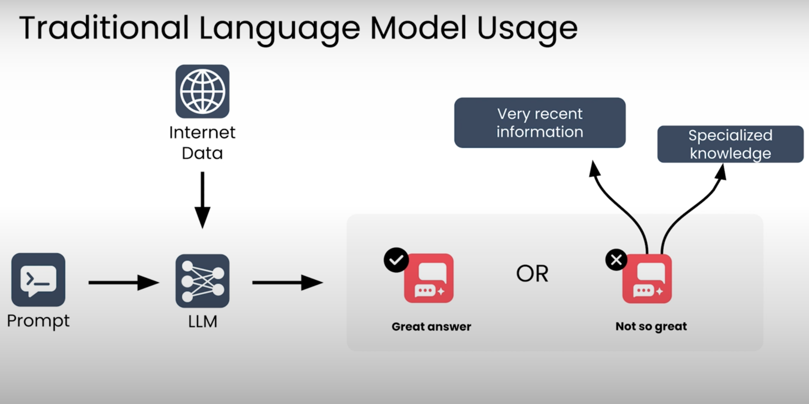

# Retrieval Augmented Generation (RAG)

Retrieval Augmented Generation **RAG**, büyük dil modellerinin (LLM) yanıt kalitesini ve doğruluğunu artırmak için en yaygın kullanılan tekniktir.

Bir LLM başlangıçta yalnızca eğitildiği verileri — genellikle kamuya açık internet verilerini — bilir. Eğer şirketinize ait dokümanlar gibi özel (proprietary) verilerden gelen bilgilerle soruları yanıtlaması gerekiyorsa, RAG modele bu ek verilere erişim sağlayarak bunu mümkün kılar.

Bu sayede LLM, eğitim sırasında görmediği gerçeklere dayanarak soruları yanıtlayabilir.

Örneğin, ChatGPT, Claude veya Gemini gibi sohbet botlarının sorunuza cevap verirken “web’de arama yapıyorum” dediğini görmüş olabilirsiniz. Bu durumda LLM, yanıtının güncel ve doğru olmasını sağlamak için ek bilgiye erişmektedir.

---

## RAG Neden Önemli?

RAG’in en sevilen yönlerinden biri, büyük dil modellerinin gücünü **basit ve pratik bir şekilde odaklamayı** sağlamasıdır.

RAG’in temel fikri:

> Klasik arama sistemlerini, büyük dil modellerinin akıl yürütme yetenekleriyle birleştirmek.

Kursta:

- Arama sistemlerinin temelleri
- LLM’lerin temel prensipleri
- Yüksek performanslı bir RAG sistemi tasarlamak için pratik ipuçları

arasında dengeli bir içerik sunulmaktadır.

RAG kavramı karmaşık değildir, ancak uygulanmasının sayısız yolu vardır.  
Tasarım seçimleri sisteminizin:

- Doğruluğunu
- Hızını

büyük ölçüde etkiler.

---

## Bu Kursta Neler Öğreneceksiniz?

- Verinizi RAG sistemi için nasıl hazırlayacağınızı
- Dil modelinizi en iyi şekilde nasıl prompt edeceğinizi
- Gerçek kullanıcı trafiğini analiz ederek kaliteyi nasıl ölçeceğinizi
- RAG sisteminizi nasıl iyileştirip optimize edeceğinizi

öğrenmiş olacaksınız.

Ayrıca bu tekniklerin **neden işe yaradığını** anlayacak temel bir kavramsal çerçeveye sahip olacaksınız.

---

## RAG Nerelerde Kullanılıyor?

RAG bugün dünyada en yaygın geliştirilen LLM tabanlı uygulamalardan biridir.

### Büyük Şirketler:
- Müşterilere ürün sorularını yanıtlamak
- Çalışanlara şirket içi politika bilgisi sağlamak

### Startuplar:
- Sağlık (tıbbi sorulara yanıt)
- Eğitim (öğrenciye konu anlatımı)
- Ve birçok farklı sektör

---

## RAG ve LLM Teknolojisinin Evrimi

LLM teknolojisi geliştikçe RAG sistemleri de gelişiyor.

### Son yıllardaki gelişmeler:

- Yeni nesil modeller, verilen dokümanlara daha “grounded” şekilde bağlı kalıyor.
- Hallucination oranları düşüyor.
- Akıl yürütme (reasoning) yetenekleri arttı.
- Daha karmaşık sorular çözülebiliyor.

### Context Window’un Artması

LLM’lerin bağlam penceresi büyüdükçe:

- Dokümanları nasıl böleceğiniz (chunk size)
- Hangi parçaları modele vereceğiniz
- Hiperparametre ayarları

gibi konuların en iyi uygulamaları da değişti.

Artık küçük bir context’e çok fazla bilgi sıkıştırmak zorunda değilsiniz.

---

## Doküman İşleme ve Agentic Sistemler

Gelişmiş doküman çıkarımı teknikleri sayesinde:

- PDF
- Sunum dosyaları
- Diğer doküman türleri

üzerine RAG sistemleri daha kolay kurulabiliyor.

Ayrıca çok adımlı agentic sistemlerde RAG genellikle bir bileşen olarak kullanılıyor.  
Örneğin bir kurumsal iş akışında, ajan bir dokümanı işlemek için RAG’den bilgi alabilir.

---

## Agentic RAG

İlk nesil RAG sistemlerinde:

- Bir insan mühendis
- Kurallar yazar
- Dokümanları böler
- Kaç parça alınacağını belirler
- LLM’e verilecek context’i belirlerdi

Yani bağlamı insan belirliyordu.

### Agentic RAG’de ise:

- AI ajanına bilgi arama araçları verilir
- Web araması yapmaya kendisi karar verebilir
- Hangi anahtar kelimeleri kullanacağını seçebilir
- Uzman bir veritabanını sorgulayabilir
- İlk arama yeterli değilse ikinci tur retrieval yapabilir

Bu sistemler:

- Daha esnek
- Daha güçlü
- Gerçek dünyanın karmaşıklığına daha dayanıklı

hale gelir.

Hata yapabilirler ama geri dönüp stratejiyi düzeltebilirler.

---

## Bu Notların Kapsamı

Bu kursta:

- Temel RAG
- İleri seviye agentic RAG
- Mental modeller
- Sistem tasarım prensipleri
- Hiperparametre ayarlama (örneğin chunk size seçimi)
- Context yönetimi

gibi geniş bir yelpazeyi öğreneceksiniz.

---

## Kimler İçin Uygun?

Eğer Generative AI uygulamaları geliştirmeye yeni başlıyorsanız:

- Bu kurs size yalnızca RAG’i değil
- RAG’i oluşturan bileşenleri
- Bu bileşenlerin başka uygulamalarda nasıl kullanılabileceğini

öğretecektir.

Bu kurs:

- RAG sistemi kurmanızı sağlar
- Gen AI araçlarını bir araya getirerek uygulama tasarlamayı öğretir
- Değerlendirme ve sürekli iyileştirme yaklaşımı kazandırır

---

## Sonraki Adım

İster:

- Bağımsız bir RAG sistemi kurun,
- İster daha karmaşık, agentic bir sistemin parçası olarak kullanın,

etkili bir RAG sistemi oluşturmak için gerekli roadmap edineceksiniz.

Şimdi RAG’in detaylarına geçelim.

---

# Modül 1 – RAG’e Giriş ve Temel Sistem Kurulumu

Güçlü bir RAG sistemi kurmak istiyorsanız, işe sağlam bir **blueprint (taslak mimari plan)** ile başlamanız gerekir.

Bu modülde:

- RAG’in temel kavramlarını öğrenecek,
- Bir RAG sisteminin ana bileşenlerini tanıyacak,
- Ve çalışan basit bir RAG sistemi oluşturmaya başlayacaksınız.

---

### 1. RAG’e Üst Düzey Giriş

İlk olarak şunları öğreneceksiniz:

- RAG nedir?
- Neden kullanılır?
- Büyük dil modellerinin (LLM) yanıt kalitesini nasıl artırır?

---

### 2. RAG Sistem Mimarisi

Daha sonra bir RAG sisteminin mimarisini yakından inceleyeceksiniz.

RAG şunları birleştirir:

- **LLM (Large Language Model)**
- **Retriever (Bilgi Getirici Bileşen)**

Retriever, LLM’in güvenilir bir bilgi tabanındaki ilgili bilgileri bulmasına yardımcı olur.

Bu modülde:

- Her bileşeni ayrı ayrı detaylı inceleyecek,
- Ardından bu bileşenlerin birlikte nasıl çalıştığını göreceksiniz.

---

### 3. Gerçek Dünya Örnekleri

RAG çok farklı bağlamlarda kullanılabilir.

Bu nedenle:

- Üretim ortamında çalışan çeşitli RAG sistemlerini inceleyecek,
- Kendi LLM tabanlı projelerinizde RAG’i nerede kullanabileceğinizi düşünmeye başlayacaksınız.

---

### 4. Uygulamalı Kod Çalışmaları

Modül boyunca:

- Örnek kodlarla pratik yapacaksınız.
- Modül sonunda ilk programlama ödevinizi tamamlayacaksınız.
- Basit bir RAG sisteminin bazı parçalarını kendiniz implemente edeceksiniz.

---

## Kursun Devamında

Bu ilk sistemi zamanla geliştireceksiniz.

Aşağıdaki daha gelişmiş özellikleri ekleyeceksiniz:

- Daha güçlü bir retriever
- Bir vektör veritabanı
- LLM’in daha sofistike kullanımı
- İzleme (monitoring) ve değerlendirme teknikleri

---

# RAG Nedir? – Retrieval ve Generation Mantığı

LLM’ler (Büyük Dil Modelleri) gerçekten etkileyici araçlardır.  

  

- Soruları yanıtlayabilirler  
- Metin özetleyebilir veya yeniden yazabilirler  
- Dokümanlara geri bildirim verebilirler  
- Kod üretebilirler  
- Ve çok daha fazlası  

Birkaç yıl öncesine kadar bu tür görevler bilgisayarlar için ulaşılamaz görünüyordu. Bir LLM ile etkileşime geçmek çoğu zaman başka bir insanla çalışıyormuş gibi hissettirebilir.

---

## RAG Neyi İyileştirir?

**RAG (Retrieval Augmented Generation)**, büyük dil modellerinin performansını daha da artıran bir yaklaşımdır.  

  

Bunu, modele eğitim sırasında bilmediği bilgilere erişim sağlayarak yapar.

Bu fikri anlamak için birkaç örneğe bakalım.

---

## Örnek 1

Soru:  
> Oteller hafta sonu neden pahalıdır?

Buna muhtemelen cevap verebilirsiniz:  
Hafta sonları daha fazla insan seyahat eder, dolayısıyla odalar için rekabet artar.

---

## Örnek 2

Soru:  
> Vancouver’daki oteller bu hafta sonu neden aşırı pahalı?

Bu soruya cevap verebilmek için daha fazla bilgi gerekir.

İnternette arama yaparsanız, örneğin uluslararası süperstar Taylor Swift’in bu hafta sonu Vancouver’da iki gecelik bir konser verdiğini öğrenebilirsiniz.

Bu ek bilgiyle soruya daha doğru bir cevap verebilirsiniz.

---

## Örnek 3

Soru:  
> Vancouver’da şehir merkezine yakın neden daha fazla otel kapasitesi yok?

Bu soruya cevap vermek için muhtemelen:

- Vancouver’ın gelişim tarihini  
- Genel şehir planlaması prensiplerini  
- İmar politikalarını  

araştırmanız gerekir.

Yani daha uzmanlaşmış ve derin bilgiye erişmeniz gerekir.

---

## İnsan Gibi İki Aşamalı Düşünme

Bu sorulara verdiğiniz cevapları iki aşamada düşünebilirsiniz:

1. Gerekli bilgiyi toplamak  
2. Bu bilgi üzerinde akıl yürüterek cevap üretmek  

İlk soruda bilgi toplamanıza gerek yoktu.  
Genel dünya bilginiz yeterliydi.

Diğer sorularda ise:

- Az miktarda bilgi
- Ya da çok miktarda uzman bilgi

toplamanız gerekiyordu.

---

## RAG’de Bu Süreç Nasıl Adlandırılır?

- Collect information → **Retrieval (Bilgi Getirme)**
- Reason & Respond → **Generation (Üretim)**

---

## LLM’ler Neden Retrieval’dan Faydalanır?

LLM’leri şimdilik şöyle düşünebilirsiniz:

  

> İnternetin büyük bölümlerini okumuş, genel kültürü geniş bir kişi.

Bir prompt gönderdiğinizde, model bu genel bilgisini kullanarak cevap üretir.

Birçok durumda bu gayet iyi çalışır.

Ancak bazı durumlarda model:

- Çok yeni bir olay hakkında bilgi sahibi değildir  
- Özel veya şirket içi verileri bilmez  
- Eğitim verisinde yer almayan uzman bilgileri içermez  

Tıpkı bir insan gibi, bir LLM’den her konuda uzman olmasını beklemek gerçekçi değildir.

Daha iyi bilgiye erişimi olduğunda, çok daha iyi yanıtlar üretir. Bu gözlem, RAG’in temel fikridir.

---

## LLM’ler Nasıl Çalışır?

LLM’ler:

- İnsan değildir  
- Wikipedia okuyan varlıklar değildir  

Onlar:

- Matematiksel modellerdir  
- Açık internetten toplanmış devasa veri kümeleri üzerinde eğitilmişlerdir  

Eğitim sırasında model, veri setinde bulunan bilgileri öğrenir.

Bir prompt gönderdiğinizde, model bu eğitim verisinde yer alan bilgilerin sorunuzla ilgili olmasını “umut eder”.

Ancak:

- Şirketlerin özel veritabanları vardır  
- Bazı bilgiler erişilmesi zordur  
- Haberler her dakika yayınlanmaktadır  

Dolayısıyla her zaman modelin bilmediği bilgiler olacaktır.

---

## Peki LLM’e Bu Bilgiyi Nasıl Öğretiriz?

Kısa cevap:

> Bilgiyi prompt’un içine koyarsınız.

RAG’in temel fikri şudur:

Prompt’u LLM’e göndermeden önce değiştirebilirsiniz.

Kullanıcının orijinal sorusuna ek olarak, modele yardımcı olacak bilgileri prompt’a ekleyebilirsiniz.

---

## RAG Sistemi Nasıl Çalışır?

Örneğin şu soru sorulursa:

> Vancouver’daki oteller bu hafta sonu neden aşırı pahalı?

RAG sistemi şu adımları izler:

1. **Retrieval aşaması**  
   İlgili bilgileri toplar.

2. **Augmented Prompt oluşturma**  
   - Orijinal soru  
   - Getirilen (retrieved) bilgiler birleştirilir.

3. **Generation aşaması**  
   LLM, bu zenginleştirilmiş prompt ile doğru yanıtı üretir.

Artık modelin doğru cevap vermek için ihtiyaç duyduğu bilgi vardır.

---

## Retriever Nedir?

Bu bilgilerin bir yerden getirilmesi gerekir.

RAG sisteminde bu işi yapan bileşene:**Retriever (Bilgi Getirici)** denir.

Retriever:
- Güvenilir
- İlgili
- Gerekirse özel (private)
bilgilerden oluşan bir bilgi tabanını yönetir.

Bir prompt geldiğinde:
- En ilgili bilgileri bulur  
- Bunları LLM ile paylaşır  

Model de cevabını üretirken bu bilgileri kullanarak cevabını iyileştirir.

---

## İsim Neden “Retrieval Augmented Generation”?

İsim uzun olabilir ama mantığı basittir:

> LLM’in metin üretme sürecini, önce ilgili bilgileri getirerek (retrieval) zenginleştiriyorsunuz (augment).

Yani:

- Önce bilgi getir  
- Sonra üretimi bu bilgiyle yap  

---
