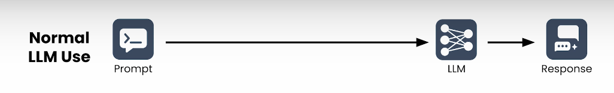
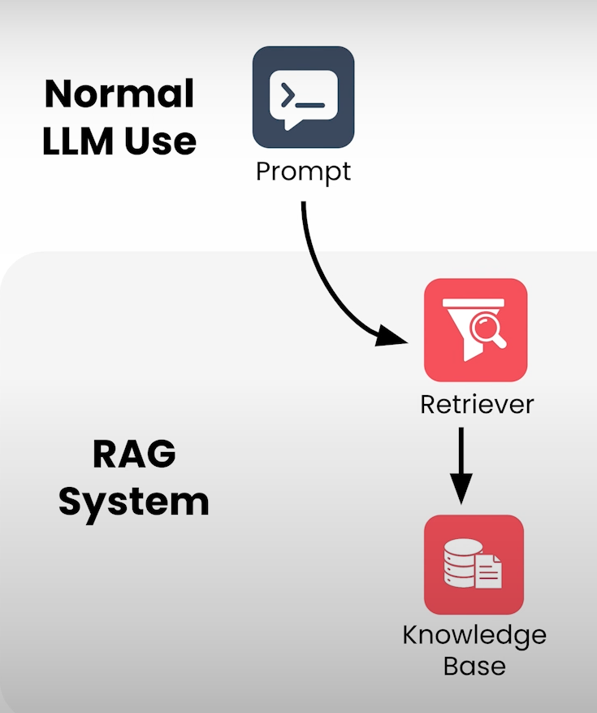
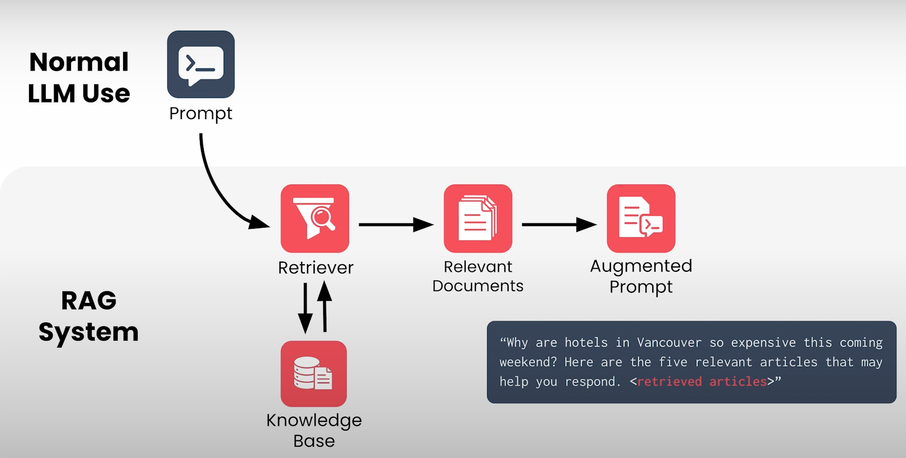
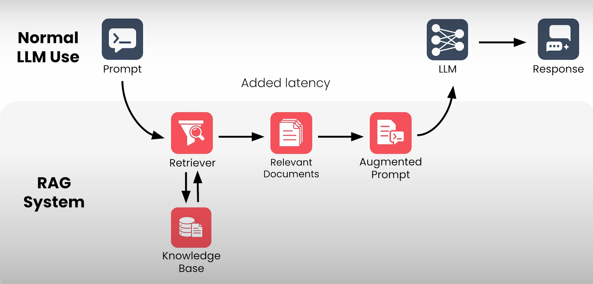
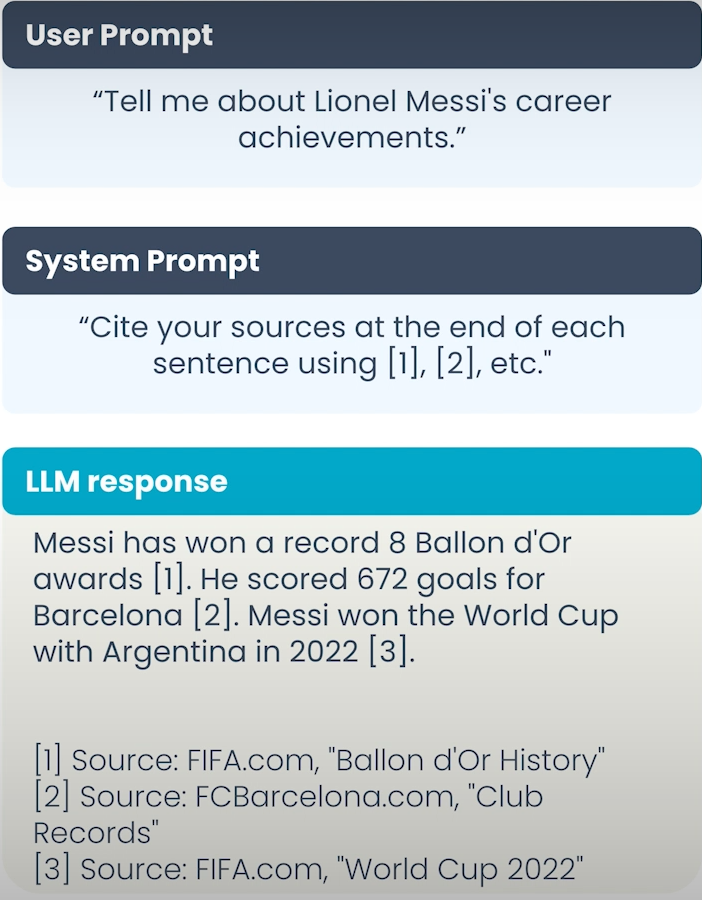
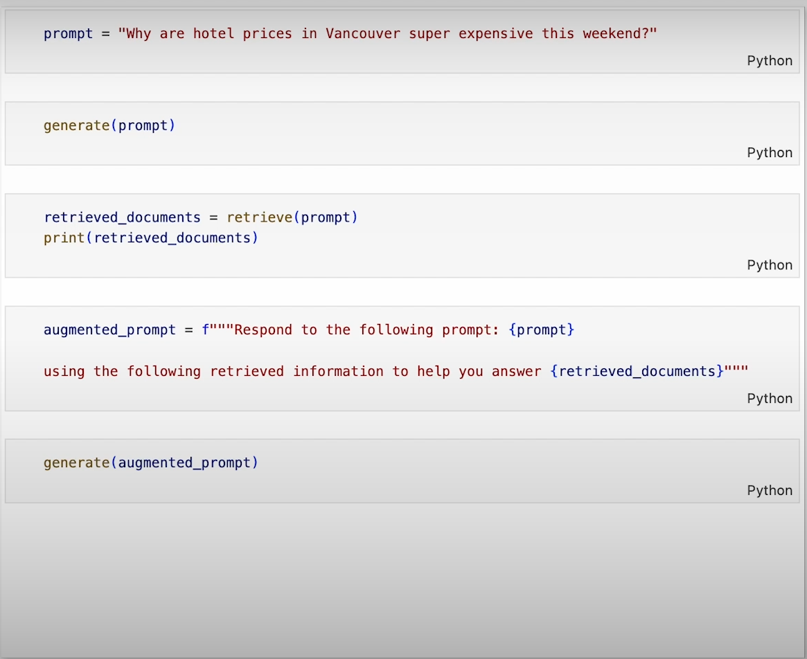

# RAG Sistem Mimarisi

Daha önce bir RAG sisteminin en önemli bileşenlerini gördük:

- **LLM (Large Language Model)**
- **Bilgi tabanı (Knowledge Base)**
- **Retriever (Bilgi getirici)**

Şimdi bu bileşenlerin birlikte nasıl çalıştığını ve genel mimarinin nasıl göründüğünü inceleyelim.

---

## LLM’i Normalde Nasıl Kullanırız?

Standart kullanım:

  

1. Bir prompt yazarsınız.
2. LLM’e gönderirsiniz.
3. LLM yanıt üretir.

RAG sisteminde kullanıcı deneyimi **aynıdır**:

- Prompt gönderirsiniz.
- Yanıt alırsınız.

Ancak sistemin içinde birkaç ek adım vardır.

---

## RAG İçinde Neler Olur?

### 1. Prompt Retriever’a Gider

RAG sistemi prompt’u aldığında önce retriever’a yönlendirir.

> Retriever’ın  bilgi tabanına (genellikle faydalı dokümanlardan oluşan bir veritabanı)na erişimi vardır.

  

Retriever:
- Veritabanını sorgular
- Prompt ile en ilgili dokümanları döndürür

---

### 2. Augmented Prompt Oluşturulur

Sistem, orijinal prompt’a getirilen bilgileri ekleyerek bir **zenginleştirilmiş prompt (augmented prompt)** oluşturur.

  

Örneğin:
Aşağıdaki soruyu cevapla:
Vancouver’daki oteller bu hafta sonu neden çok pahalı?

Yanıt vermene yardımcı olabilecek 5 ilgili makale aşağıdadır:
[Makale içerikleri buraya eklenir]

---

### 3. LLM Yanıtı Üretir

Bu augmented prompt LLM’e gönderilir.

LLM artık:
- Eğitim sırasında öğrendiği genel bilgiyi
- Getirilen dokümanlardan gelen ek bağlamı
birlikte kullanarak yanıt üretir.

  

---

## Kullanıcı Deneyimi

Kullanıcı açısından:

- Prompt yazılır
- Yanıt alınır

Belki küçük bir gecikme (latency) olabilir.

Ancak retriever sayesinde:

- Yanıtın doğru olma ihtimali artar. Hallucination azalır.
- Modelin güncel cevap verme ihtimali artar
- Bağlama uygunluk artar

---

## RAG’in Avantajları

### 1. Ek Bilgi Sağlar

LLM’in eğitiminde olmayan bilgileri erişilebilir kılar:

- Şirket politikaları
- Kişisel bilgiler
- Güncel haberler

Bazı bilgiler LLM’e başka şekilde ulaştırılamaz; RAG tek çözümdür.

---

### 2. Hallucination’ı Azaltır

LLM’ler bazen:

- Eğitim verisinde olmayan
- Nadiren geçen

konular hakkında uydurma (hallucination) cevaplar üretebilir.

Prompt’a ilgili bilgiyi doğrudan eklemek:

- Yanıtı "grounded" hale getirir
- Yanıltıcı ve genel cevapları azaltır

---

### 3. Güncelliği Kolaylaştırır

Bir LLM’i yeniden eğitmek:

- Maliyetlidir
- Zaman alır

RAG sisteminde ise:

- Bilgi tabanını güncellersiniz
- Yeni içerik indekslenir
- LLM hemen yeni bilgiye göre yanıt verebilir

---

### 4. Kaynak Gösterme (Citation)

RAG sistemleri:

- Augmented prompt’a kaynak bilgisi ekleyebilir
- LLM bu kaynakları yanıtına dahil edebilir

Bu sayede:

- Yanıt doğrulanabilir
- Kullanıcı daha derin inceleme yapabilir

  

---

### 5. İş Bölümü (Separation of Concerns)

Retriever:

- Büyük bilgi dünyasını filtreler
- En ilgili bilgileri seçer

LLM:

- Akıcı ve anlamlı metin üretir

Yani her bileşen, en güçlü olduğu işi yapar.

---

# Basit Kod Demo Mantığı

Basitleştirilmiş bir RAG sistemi iki ana fonksiyona sahip olabilir:

### `retrieve(query)`
- Metin sorgusu alır
- Bilgi tabanından ilgili dokümanları döndürür

### `generate(prompt)`
- Prompt alır
- LLM yanıtını döndürür

  

---
