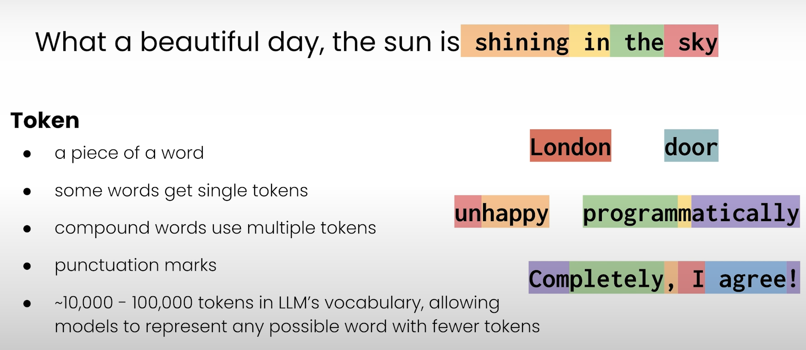
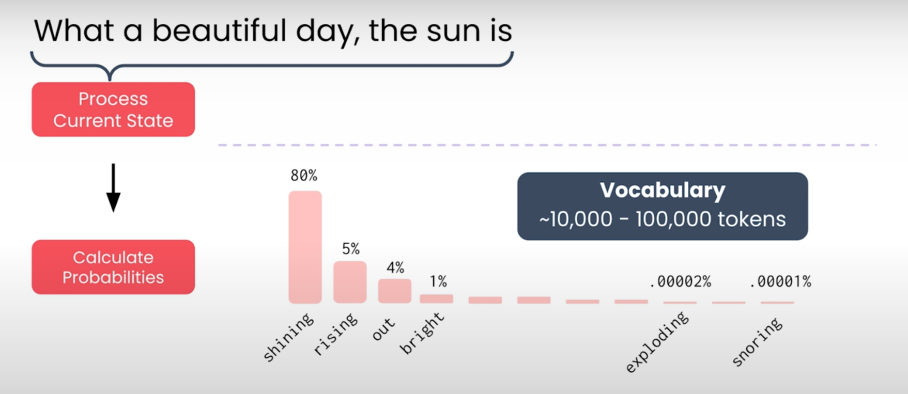
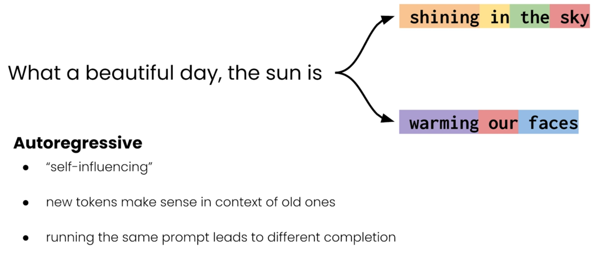
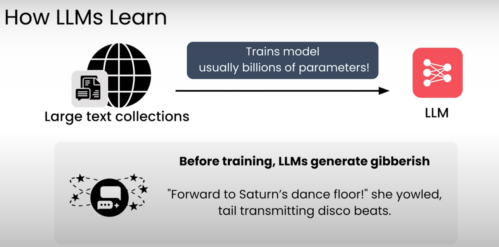
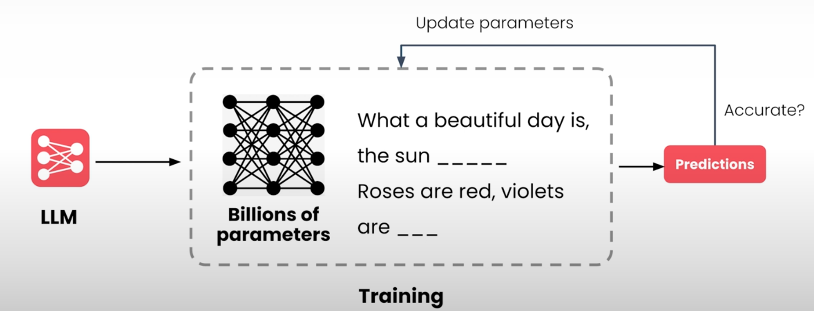

# LLM (Large Language Model) Bileşeni

Artık RAG sisteminin mimarisini gördüğümüze göre, her bileşeni tek tek inceleyelim. Öncelikle **LLM** ile başlayalım.

LLM’lerin nasıl çalıştığını, güçlü ve zayıf yönlerini anlamak, diğer bileşenlerin LLM performansını nasıl artırmak için tasarlandığını anlamamıza yardımcı olur.

---

## LLM Nedir?

Bazen şaka yollu “gelişmiş otomatik tamamlama” olarak adlandırılır.  
Aslında oldukça doğru bir tanımdır:

> LLM’ler temel olarak bir metindeki **bir sonraki kelimeyi tahmin eder.**

Örnek:

- Prompt: `What a beautiful day the sun is ...`
- Muhtemel tamamlamalar:
  - `shining` ✅
  - `rising` ✅
  - `out` ✅
  - `exploding` ❌ (gramatiksel olarak doğru ama mantıksız)

- **Prompt**: Orijinal eksik ifade  
- **Completion**: Tamamlanan ifade

---

## LLM Nasıl Çalışır?

- LLM, **nöral ağlar** kullanır:  
  Büyük ve karmaşık bir matematiksel modeldir.
- Model, kelimeler arasındaki ilişkileri ve bağlamlarını öğrenir.
- Text üretimi:
  - Yeni kelimeleri **token** bazında ekler (kelime parçaları)
  - Örnek: `shining in the sky`  

  

---

## Üretim Süreci

1. Mevcut completion durumu işlenir → Kelimeler ve anlam analizi yapılır

  

2. Tüm token’lar için olasılık hesaplanır → Hangi token gelecekte kullanılacak?

3. Bir sonraki token, olasılık dağılımına göre seçilir (rastgelelik vardır)
4. Süreç her token için tekrar edilir (**autoregressive / kendini etkileyen** mekanizma)

  

---

## Eğitim ve Parametreler

- LLM’ler **milyarlarca parametre** ile çalışır
- Eğitim:
  - Eksik metin parçaları gösterilir
  - Bir sonraki kelime tahmin edilir
  - Tahmin doğruluğuna göre parametreler güncellenir
- Amaç: Hem dilin yapısını hem de doğru bilgileri öğrenmek
- Eğitim verisi: Trilyonlarca token, çoğunlukla açık internetten

  

  

---

## LLM Davranışları

### 1. Hallucinations (Yanlış Üretimler)

- LLM’ler sadece olası kelime dizilerini üretir
- Eğitim verisinde olmayan bilgiler hakkında yanıt veremez
- Yanıt doğru gibi görünse de gerçekte yanlış olabilir
- Önemli: LLM psikolojik olarak yanılmıyor, sadece **olasılıksal metin üretiyor**

### 2. Prompt’a Bilgi Eklemek

- RAG yaklaşımı: LLM’e **ek bilgi sağlamak**
- Bu sayede LLM, eğitim verisine dahil olmayan bilgiyi yanıtına dahil edebilir
- Avantaj: Yanıtlar “grounded”, güvenilir ve güncel olur

### 3. Sınırlamalar

- Uzun prompt → Daha fazla hesaplama  
- Context window sınırı → LLM’in işleyebileceği maksimum token sayısı
  - Eski modeller: birkaç bin token  
  - Yeni modeller: milyonlarca token  

> Retriever, augmented prompt’a ek bilgi ekledikçe başta sadece maliyeti artırır, sonunda ise context window’u doldurur.

---

## Bu Kursta Kullanılan LLM

- **TogetherAI** üzerinden popüler açık kaynak modelleri
- Avantaj:
  - LLM’in iç yapısını incelemek mümkün
  - Konseptleri deneyimlemek kolay

---

### Özet

- LLM, prompt’u ve ek bilgileri işleyip yanıt üretir
- Ek bilgi prompt’a dahil edilirse LLM bunu yanıtına entegre eder
- RAG, LLM’lerin doğruluk ve bağlam açısından daha güçlü olmasını sağlar

---