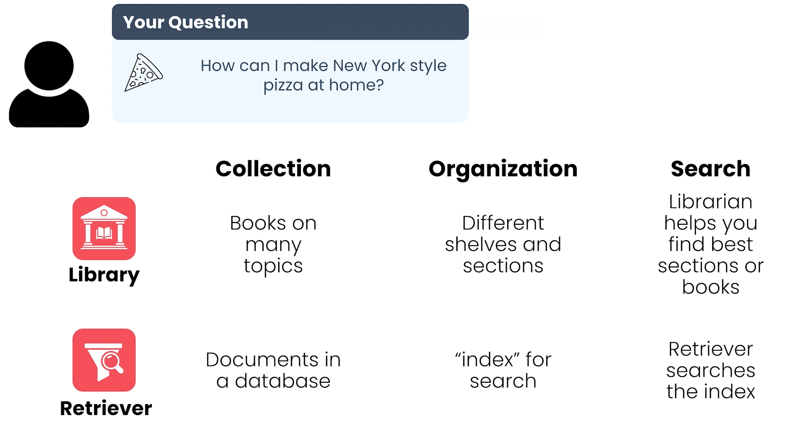
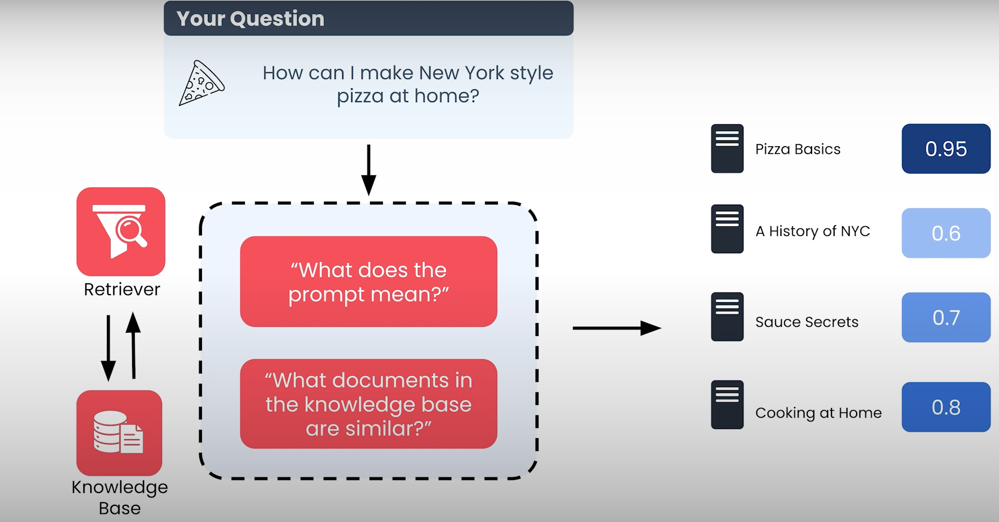

# Retriever Bileşeni (Detaylı Anlatım)

Artık retriever’ın amacı büyük ölçüde anlaşılmıştır: **LLM’e eğitim sırasında erişemediği faydalı bilgileri sağlamak**.

---

## Kütüphane Analojisi

  

- Kütüphane, birçok konuda kitaplar içerir.  
- Kitaplar konularına, türlerine ve yazarlara göre raflara ayrılmıştır.  
- Kütüphaneci (retriever), sorununuzu anlayıp ilgili bölümleri veya kitapları bulur.

**RAG sistemi eşdeğerleri:**

| Kütüphane | RAG Sistemi |
|------------|------------|
| Kitap koleksiyonu | Knowledge base (belgeler) |
| Kütüphaneci | Retriever |
| Raf ve bölüm dizini | Belge indeksi |

---

**RAG sistemi için eşdeğerler:**

  

| Kütüphane | RAG Sistemi |
|------------|------------|
| Kitap koleksiyonu | Knowledge base (belgeler) |
| Kütüphaneci | Retriever |
| Raf ve bölüm dizini | Belge indeksi |

---

## Retriever Nasıl Çalışır?

1. **Prompt’u Anlama**: Retriever, prompt’un anlamını analiz eder.  
2. **Belge İndeksinde Arama- Search Engine**: İlgili belgeleri bulmak için indeksi kullanır.  
3. **Relevans Puanlama**: Belgeleri, prompt’a göre bir skor ile sıralar.  
   - Skor genellikle **prompt ve belge metni arasındaki benzerlik** ile ölçülür.  
   - En yüksek skor alan belgeler döndürülür.  

> Not: Farklı benzerlik hesaplama yöntemleri vardır ve kurs boyunca detaylandırılacaktır.

---

## Dikkat Edilmesi Gerekenler

- **Gereksiz belgelerden kaçınmak**:  
  Tüm belgeleri döndürmek bilgiyi kaybettirir ve LLM’in context window’unu doldurabilir.  
- **Yeterli bilgi almak**:  
  Sadece en yüksek sıralı belgeler değerli bilgilerden bazılarını kaçırabilir.  
- **Optimize etme**:  
  Retriever performansı zamanla izlenmeli ve farklı ayarlarla test edilmelidir.

---

## Retriever ve Diğer Sistemler

- Web arama motorları → web sayfalarını döndürür  
- SQL veritabanları → sorguya uygun satır ve tabloları döndürür  

> Bilgi erişimi (Information Retrieval) alanı LLM’lerden önce olgunlaşmıştır ve retriever tasarımını etkiler.

---

## Retriever ve Veri Tabanları

- Mevcut şirket verileri genellikle **ilişkisel veritabanlarında** bulunur  
- Üretim ölçeğinde retriever’lar genellikle **vektör veritabanı** üzerine inşa edilir  
  - Amaç: Knowledge base’de prompt’a en uygun belgeleri hızlıca bulmak

- RELATIONAL DATABASES
- VECTOR DATABASES
---

## Bu Kursta Öğrenecekleriniz

- Bilgi erişiminin temel ilkeleri  
- Vektör veritabanlarının kullanımı  
- Üretim ölçeğinde RAG sistemleri için retriever tasarımı

---

