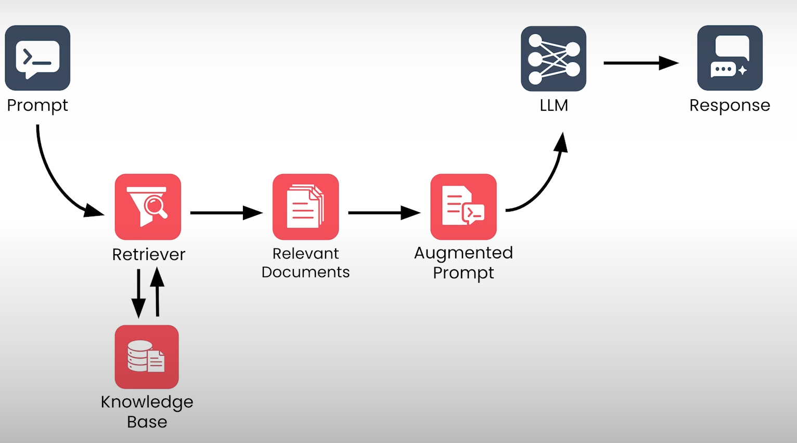
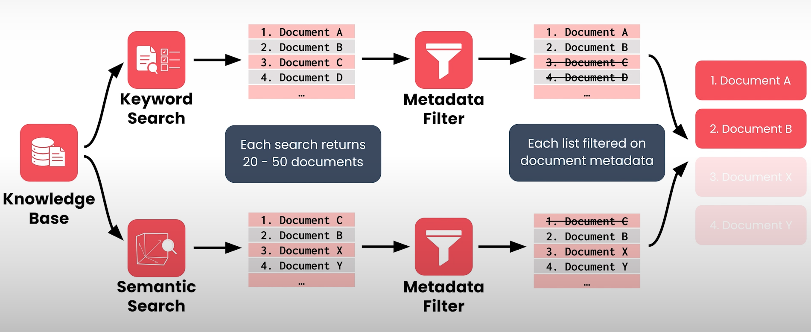
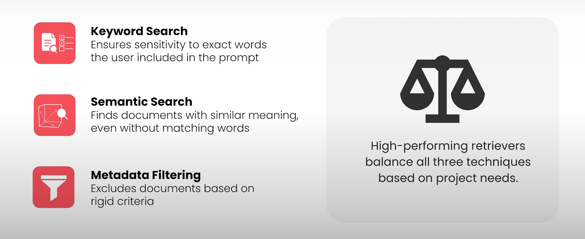

Bir **retriever**’ın (geri getirici sistemin) görevi ifade etmesi oldukça kolaydır.  

Yapması gereken tek şey, bir LLM’in bir isteme (prompt) yanıt verebilmesine yardımcı olabilecek bilgi tabanındaki belgeleri bulmaktır.  

Ancak biraz düşünürseniz, bunun aslında oldukça zor bir görev olduğunu fark edersiniz.  

Kullanıcılar RAG sisteminize iyi yapılandırılmış SQL sorguları göndermiyor.  

LLM’inizle, başka bir insanla konuşur gibi sohbet ediyorlar.

Bu arada, bilgi tabanınızdaki belgeler kişisel e-postalardan şirket içi yazışmalara ya da bir tıp dergisindeki makalelere kadar her şey olabilir.

Bilgi açısından zengin olabilirler, ancak genellikle insanların okuyabilmesi için yapılandırılmışlardır, bir bilgisayarın içinde arama yapabilmesi için değil.

Bir şekilde, bir retriever tüm bu dağınık ve düzensiz yapılandırılmış bilgiyi ele almalı ve saniyenin kesirleri içinde en ilgili parçaları hızla geri döndürmelidir.  

Bu modülde, bir retriever’ın bu başarıyı gerçekleştirmek için kullandığı temel teknikleri öğreneceksiniz.  

Her tekniğin nasıl çalıştığına dair teorik bir anlayış geliştirecek, göreceli güçlü ve zayıf yönlerini keşfedecek ve bir retriever’ın en iyi sonuçları sağlamak için bu teknikleri nasıl birlikte kullandığını göreceksiniz.  

Ayrıca, bir retriever’ın performansını değerlendirmeye yönelik bazı stratejilerle de tanışacaksınız.  

## Retriever Mimarisi ve Arama Tekniklerine Genel Bakış

Sistemin tamamına dair zihinsel bir modele sahip olmak faydalı olacaktır. Bu nedenle, modüle bir retriever’ın mimarisine ve içindeki her bir bileşenin nasıl birlikte çalıştığına üst düzey bir bakış atarak başlayalım.

Bir RAG sistemi isteminizi (prompt) aldığında, ilk olarak bu istem **retriever** bileşenine gönderilir. Retriever, bilgi tabanına erişir. Bilgi tabanını, bir veritabanında bulunan çok sayıda metin dosyasından oluşan bir yapı olarak düşünebilirsiniz.

Retriever’ın görevi, istemle en alakalı belgeleri hızlı bir şekilde belirlemek ve bunları LLM’e iletilmek üzere geri döndürmektir.

  

---

## Modern Retriever’larda Kullanılan İki Arama Tekniği

Modern retriever’ların çoğu bu süreçte iki farklı arama tekniği kullanır.

  

### 1. Anahtar Kelime Araması (Keyword Search)

Bu daha geleneksel bir yaklaşımdır. Retriever, istemde bulunan **tam kelimeleri içeren** belgeleri arar.

Bu yöntem uzun yıllardır kullanılmaktadır ve onlarca yıldır bilgi erişim sistemlerine güç sağlamaktadır.

---

### 2. Anlamsal Arama (Semantic Search)

Bu yaklaşımda retriever, istemle **benzer anlama sahip** belgeleri arar.

Bu yöntem, retriever’ı daha esnek hale getirir çünkü kullanıcının isteminde birebir geçen kelimeleri içermese bile ilgili belgeleri bulabilir.

---

## Belge Listelerinin Oluşturulması ve Filtrelenmesi

Her bir arama tekniği, genellikle 20 ila 50 belge arasında bir koleksiyon döndürür.

Çoğu zaman iki listede ortak belgeler bulunur. Ancak arama stilleri farklı olduğu için bazı belgeler bir listede diğerine göre daha üst sıralarda yer alabilir.

Bu aşamada her liste, metadata (üst veri) bilgilerine göre filtrelenir.

Örneğin:

- Bilgi tabanındaki bazı belgeler mühendislik ekibi için,
- Bazıları ise insan kaynakları (HR) için daha uygun olabilir.

Sistem, kullanıcının hangi ekibe ait olduğunu bilir ve bu noktada bir metadata filtresi uygular. Böylece yalnızca ilgili departmana uygun belgelerin sürece devam etmesine izin verilir.

---

## Nihai Sıralama ve Retrieval Sürecinin Tamamlanması

Artık retriever’ın elinde iki filtrelenmiş liste vardır:

- Biri anahtar kelime aramasıyla oluşturulmuş,
- Diğeri anlamsal aramayla oluşturulmuş.

Bu iki liste birleştirilerek en alakalı belgelerin **nihai sıralaması** oluşturulur.

Retriever, bu son listeden en üst sıradaki belgeleri döndürür. Bu noktada retrieval (belge getirme) işlemi tamamlanmış olur. Belgeler, genişletilmiş (augmented) prompt’a eklenmek üzere LLM’e gönderilir.

  

---

## Hibrit Arama (Hybrid Search)

Üstteki arama tarzı **hibrit arama** olarak adlandırılır çünkü nihai belge sıralamasını oluşturmak için birden fazla teknikten yararlanır.

Her teknik, retriever’ın genel performansına katkı sağlayan farklı avantajlar sunar:

- **Anahtar kelime araması**, sistemin kullanıcının isteminde geçen tam kelimelere duyarlı olmasını sağlar.
- **Anlamsal arama**, aynı kelimeleri kullanmasa bile anlamca benzer belgelerin bulunmasını sağlar.
- **Metadata filtreleme**, diğer iki yaklaşımın sağlayamadığı şekilde katı kriterlere dayalı eleme yapılmasına imkân tanır.

  

---

## Yüksek Performanslı Retriever Tasarımı

Yüksek performanslı bir retriever tasarlamak:

- Bu tekniklerin her birinin göreli güçlü yönlerini anlamayı,
- Ardından proje ihtiyaçlarına uygun şekilde aralarındaki dengeyi ayarlamayı gerektirir.

Şimdi bu üç teknikten her birini ayrıntılı olarak incelemeye başlayacağız. İlk olarak, en basit olan teknikle başlıyoruz: **metadata filtreleme**.

