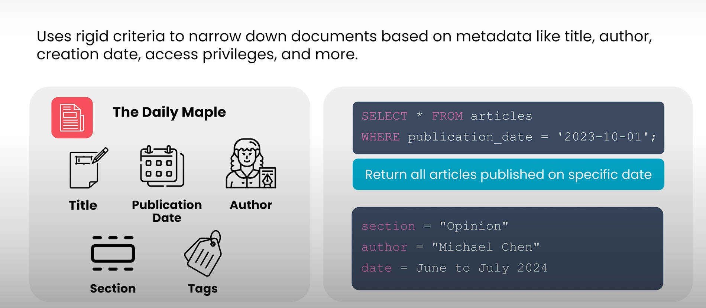
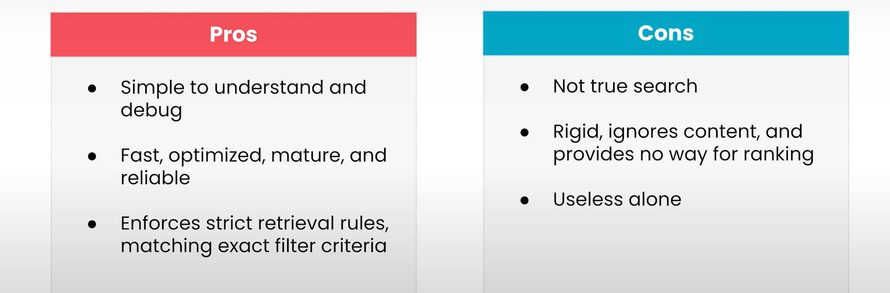

## Metadata Filtering (Üst Veri Filtreleme)

Metadata filtreleme, bir retriever içinde kullanılan en basit ve muhtemelen en tanıdık tekniktir.

Metadata filtreleme, belgelerin metadata (üst veri) bilgilerine dayanarak, retriever tarafından döndürülen belgeleri **katı kriterlerle daraltır**.

Bu metadata bilgileri şunlar olabilir:

- Belgenin başlığı  
- Yazarı  
- Oluşturulma tarihi  
- Erişim izinleri  
- vb.

---

## Basit Bir Örnek

Bir gazetede çalıştığınızı ve gazetenizin tarih boyunca yayımladığı makaleler için bir retriever oluşturmak istediğinizi düşünün.

Bilgi tabanınız binlerce farklı makale içeriyor olsun.

Her makale şu metadata bilgileriyle etiketlenmiş olabilir:

- Başlık  
- Yayın tarihi  
- Yazar  
- Gazetenin hangi bölümünde yayımlandığı  
- vb.

Her makalenin tam metni bilgi tabanında saklanır, ancak sistem arama işlemini yalnızca bu metadata bilgileri üzerinden yapabilir.

Bu tür bir indeks üzerinde sorgu yapmak, SQL sorgusu yazmaya oldukça benzer.

  

---

## Tekli ve Çoklu Filtreleme

Tek bir metadata alanına göre filtreleme yaparsanız:

- Belirli bir günde yayımlanan tüm makaleleri  
- Ya da belirli bir yazarın yazdığı tüm makaleleri  

bulabilirsiniz.

Daha karmaşık sorgular da yazabilirsiniz ve birden fazla metadata alanına göre filtreleme yapabilirsiniz.

Örneğin:

> 2024 yılının Haziran ve Temmuz ayları arasında, görüş (opinion) bölümünde yayımlanmış ve favori gazeteciniz tarafından yazılmış tüm makaleleri bulabilirsiniz.

Yalnızca **tüm koşulları sağlayan** makaleler döndürülür; diğerleri filtrelenir.

Eğer bir elektronik tabloda (örneğin Excel) tablo filtrelediyseniz, aslında metadata filtreleme yapmışsınızdır.  
Yaptığınız şey, büyük bir veri kümesi içinden hangi öğeleri kullanmak istediğinizi belirlemek için katı kriterler uygulamaktır.

---

## RAG Sistemlerinde Metadata Filtreleme

Tipik bir RAG sisteminde metadata filtreleme doğrudan retrieval yapmak için değil,  
**diğer retrieval tekniklerinin döndürdüğü sonuçları daraltmak için** kullanılır.

Ayrıca filtreler genellikle kullanıcının prompt’ta söylediklerinden değil,  
isteği yapan kullanıcının diğer özelliklerinden belirlenir.

---

## Erişim Yetkisi Örneği

Gazete örneğine geri dönelim.

Diyelim ki:

- Bazı makaleler ücretsiz olarak herkese açık,
- Bazıları ise yalnızca ücretli abonelere açık.

Her makalede, ücretsiz mi yoksa ücretli mi olduğunu belirten bir metadata alanı olabilir.

Bir kullanıcı arama yaptığında sistem onun ücretli abone olup olmadığını tespit eder.

- Eğer kullanıcı abone değilse,  
  metadata filtresi ücretli makaleleri sonuçlardan hariç tutar.

---

## Bölge (Region) Örneği

Gazeteniz dünyanın farklı bölgelerinde yayın yapıyor olabilir.

Her makalede, hangi bölgede yayımlandığını belirten bir metadata alanı bulunabilir.

Kullanıcı sorgu yaptığında sistem onun hangi bölgede bulunduğunu tespit eder ve  
yalnızca o bölgeye ait makaleleri döndürür.

---

## Metadata Filtrelemenin Avantajları

  

1. **Kavramsal olarak basittir.**  
   Sistemin nasıl çalıştığını anlamak ve hataları ayıklamak kolaydır.

2. **Hızlı ve optimize edilmiştir.**  
   Olgun ve iyi optimize edilmiş bir yaklaşımdır.

3. **Katı kurallara dayalı karar verme imkânı sunar.**  
   Belgelerin dahil edilip edilmeyeceğini kesin kriterlerle belirlemenizi sağlayan tek yaklaşımdır.

Eğer hangi tür belgelerin kesinlikle dahil edilmesi veya edilmemesi gerektiğini net bir şekilde tanımlamak istiyorsanız, bunu sağlayabilecek tek yöntem metadata filtrelemedir.

---

## Metadata Filtrelemenin Sınırlamaları

Bununla birlikte önemli sınırlamaları vardır:

- Gerçek anlamda bir arama tekniği değildir.
- Belgenin içeriğini dikkate almaz.
- Aşırı katıdır.
- Filtreden geçen belgeler arasında bir sıralama yapma mekanizması yoktur.

RAG sistemlerinde büyük olasılıkla metadata filtreleri kullanacaksınız.  
Ancak yalnızca metadata filtrelemeye dayalı bir retriever oluşturmak pratikte işe yaramaz olur.

---

## Sonuç

Metadata filtreleme basit ve etkilidir.  
Ancak gerçek değer üretmesi için diğer arama teknikleriyle birlikte kullanılmalıdır.

Özellikle, bir belgenin içeriğinin prompt ile gerçekten alakalı olup olmadığını belirleyecek bir yönteme ihtiyaç vardır.

Bir sonraki bölümde, bu ihtiyacı nasıl karşıladığını görmek için **anahtar kelime aramasını (keyword search)** inceleyeceğiz.