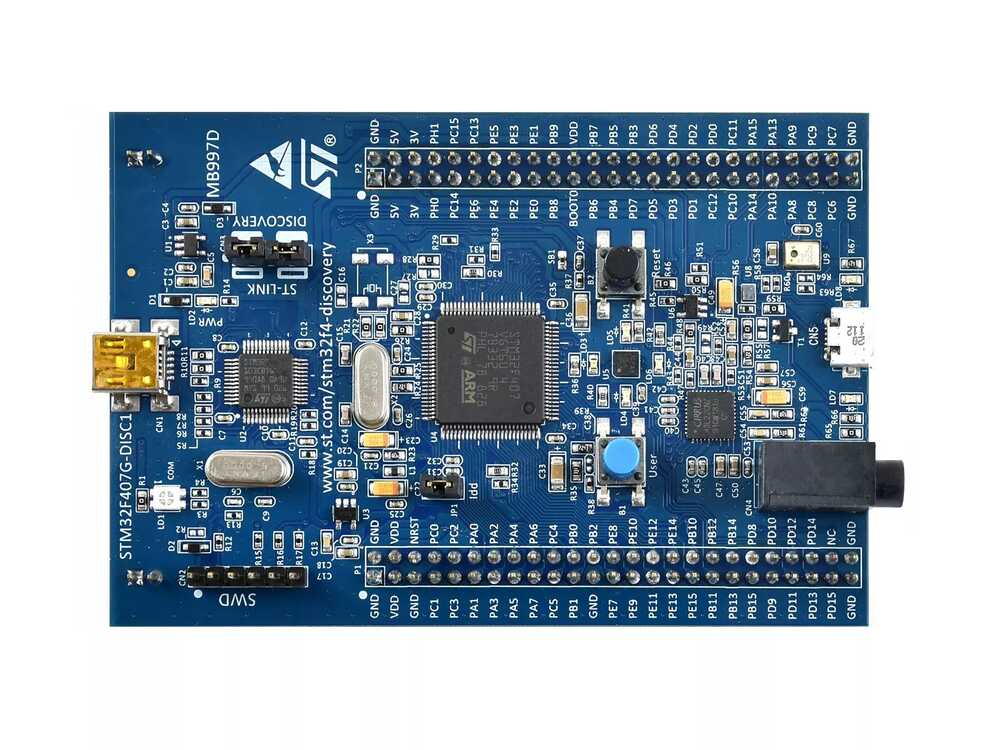
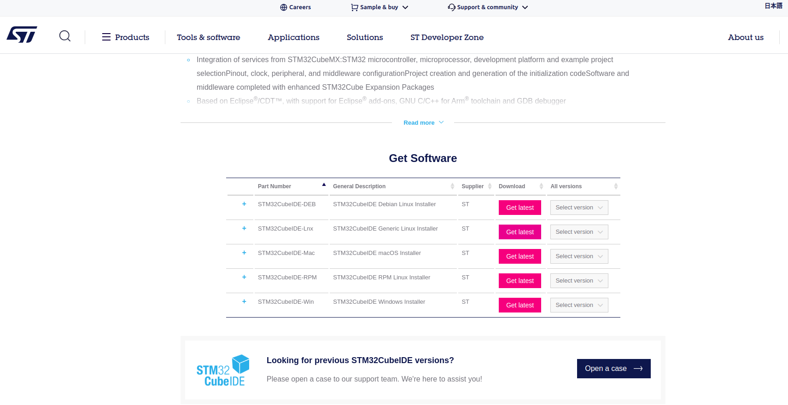
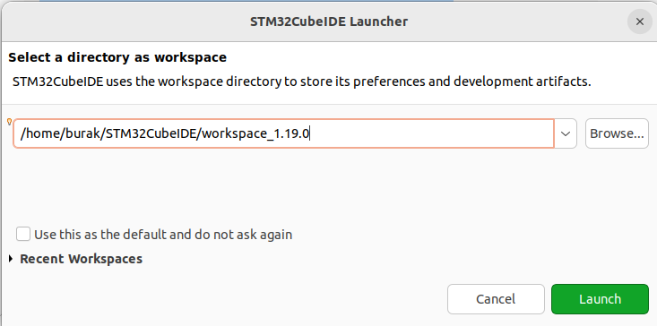
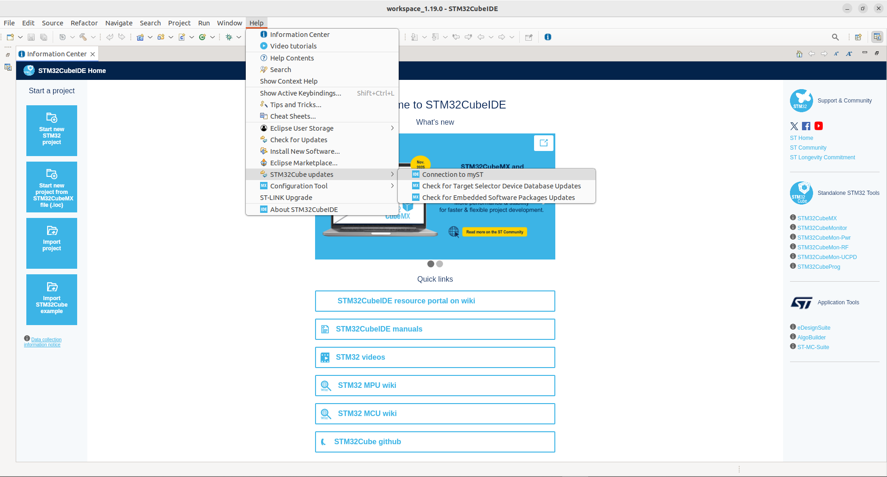

# STM32CubeIDE Installation & Overview

<p align="center">

<br>
<em><b>STM32F407VET6</b> STM32 Discovery</em>
</p>

STM32CubeIDE is the official, fully integrated development environment provided by STMicroelectronics for STM32 microcontrollers.

👉 Download page:  
https://www.st.com/en/development-tools/stm32cubeide.html

for linux:
* Sign up or log in MyST account (required for the download).
* install debian linux installer
<p align="center">

</p>

* Once the download is complete, you will have a compressed .zip file in your Downloads folder.

* unzip the bash script
```bash
unzip st-stm32cubeide_1.19.0_25607_20250703_0907_amd64.deb_bundle.sh.zip
```
```bash
chmod +x st-stm32cubeide_1.19.0_25607_20250703_0907_amd64.deb_bundle.sh
```
```bash
sudo ./st-stm32cubeide_1.19.0_25607_20250703_0907_amd64.deb_bundle.sh
after installation complete open IDE and connect to MyST
```
follow the licence agreement with space and accept.

create alias
```bash
nano ~/.bashrc
```
add the end of file
```bash
alias stm32='/opt/st/stm32cubeide_1.19.0/stm32cubeide'
```
type bash in terminal and try to launch CubeIDE with
```bash
stm32
```
select a directory as workspace screen will open.
launch the IDE
<p align="center">

</p>

connect to ide your st account from help menu action
<p align="center">

</p>

## 1. Overview

STM32CubeIDE:

- **Is Eclipse-based**, so it works on Windows, Linux, and macOS.
- Provides all the necessary tools for embedded development **in a single package**:
  - Compiler
  - Linker
  - Debugger
  - Memory analysis tools
  - SWV/ITM debugging
- Fully integrated with STM32CubeMX → no need to install CubeMX separately.
- Uses **GNU Arm Embedded Toolchain** (`arm-none-eabi-gcc`) for ARM-based microcontrollers.

This makes it easy to develop embedded projects quickly without external dependencies.

---

## 2. Built-in Toolchain

STM32CubeIDE includes the following tools:

- **arm-none-eabi-gcc** → C/C++ compiler  
- **arm-none-eabi-gdb** → debugger  
- **arm-none-eabi-objdump / objcopy** → analysis tools  
- **linker (ld)** → suitable linker scripts for STM32  

Therefore, **no additional GCC installation is needed** when working inside the IDE.

---

## 3. Debugging Features

STM32CubeIDE is fully compatible with ST-LINK and supports:

### SWD (Serial Wire Debug)
- 2-pin debug interface  
- Register, memory, variable inspection

### SWV (Serial Wire Viewer)
- **ITM printf** (real-time printing without UART)
- Live variable watching
- PC sampling (profiling)
- Exception analysis (faults)

### Memory & Core View
- Flash/ SRAM inspection
- Peripheral register visualizer
- CPU register view (R0–R15, xPSR, etc.)

---

## 4. STM32CubeMX Integration

CubeIDE fully integrates CubeMX, so no separate installation is needed.

- Clock configuration  
- GPIO, UART, SPI, CAN, I2C settings  
- Middleware selection (FreeRTOS, USB, FATFS)  
- Automatic code generation (HAL/LL)  

All can be configured from a single interface.

---

## 5. Building Code Outside the IDE

CubeIDE contains its own toolchain; however, if you want to build from the terminal, you need the ARM toolchain.

### Windows
Mingw is for desktop applications, not for STM32 development.

Correct toolchain for STM32:  
https://developer.arm.com/downloads/-/arm-gnu-toolchain-downloads

### Linux
If you want to use your own build system (Makefile, CMake, etc.):

```bash
sudo apt install build-essential
sudo apt install gcc-arm-none-eabi
sudo apt install gdb-multiarch
```

