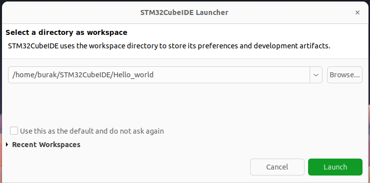
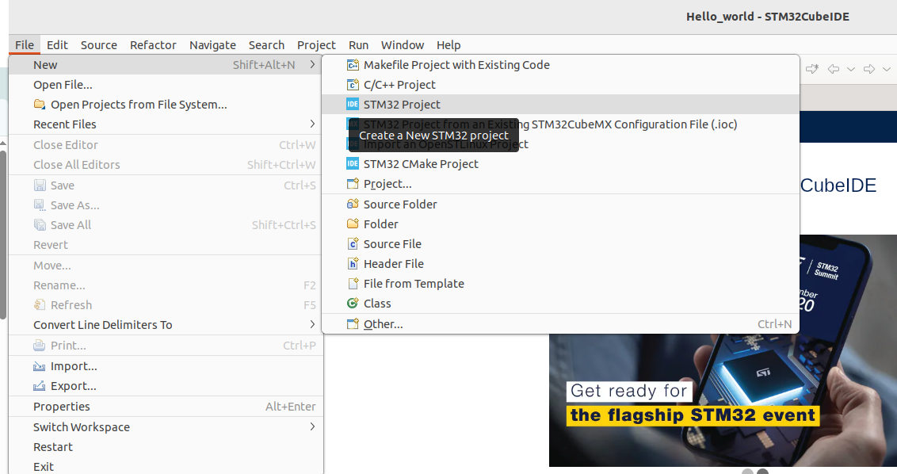
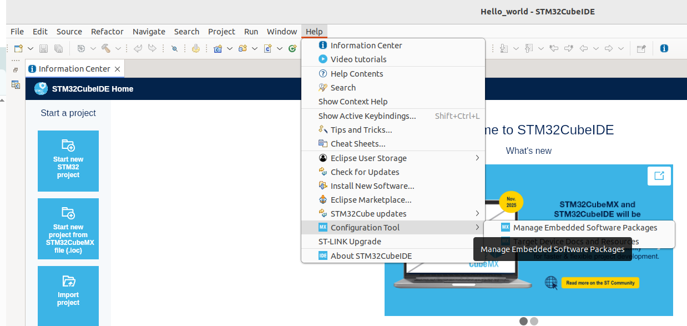
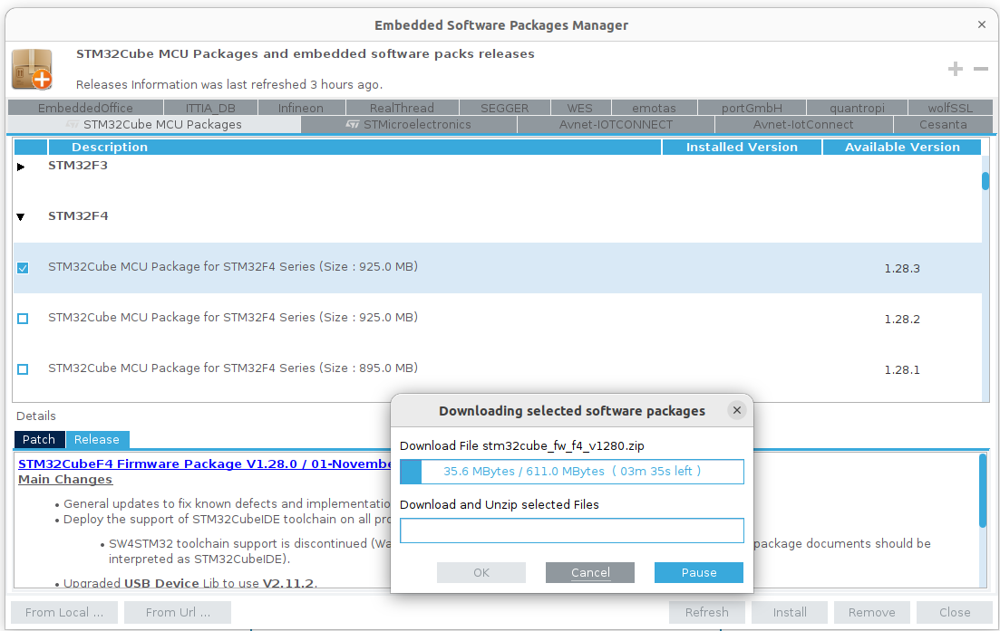
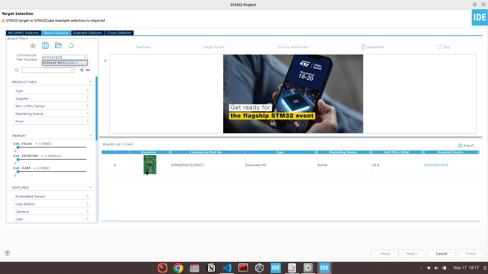
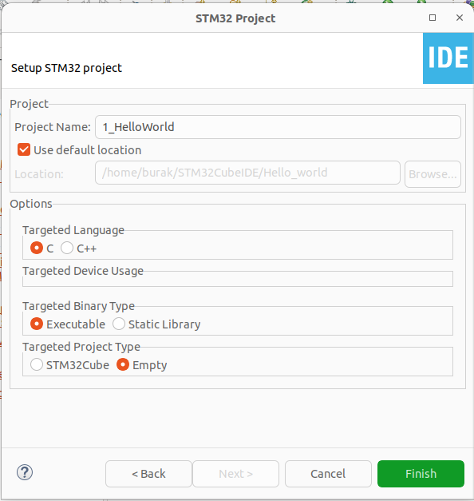
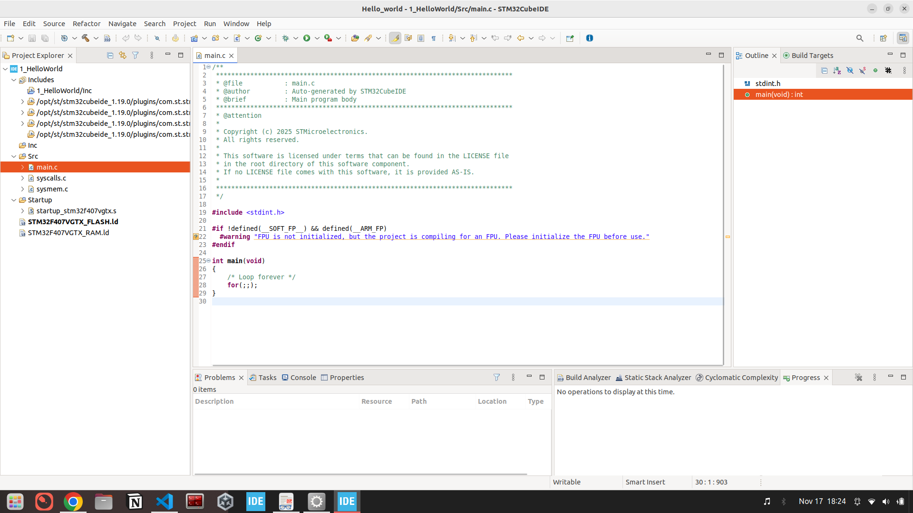
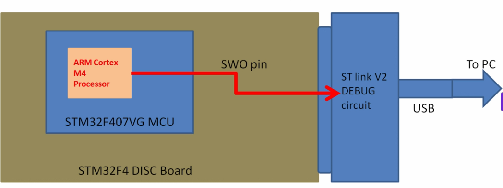
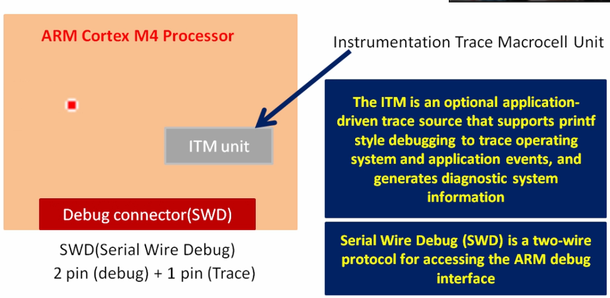
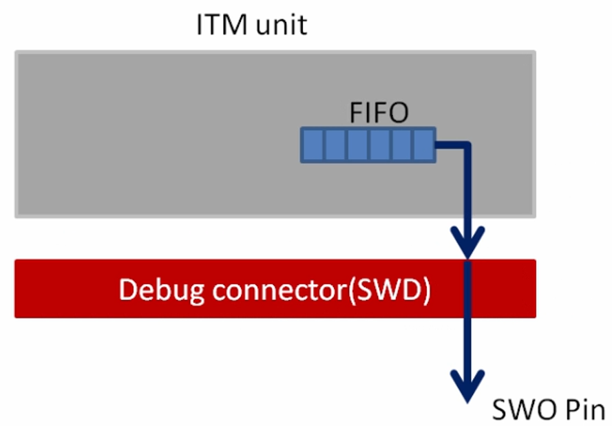

# Hello world

1. start stmCubeIDE
```bash
stm32
```

2. select workspace
click launch
<p align="center">

</p>

3. Create new STM32 Project
<p align="center">

</p>

4. install embedded software packages

<p>

</p>
select the board
<p>

</p>

5. choice the board
<p>

</p>

6. project name
<p>

</p>

7. gui
<p>

</p>

in main.c file we will write our first code

```c
/**
 ******************************************************************************
 * @file           : main.c
 * @author         : Auto-generated by STM32CubeIDE
 * @brief          : Main program body
 ******************************************************************************
 */

#include <stdio.h>

int main(void)
{
	printf("Hello world\n");
    /* Loop forever */
	for(;;);
}
```

but we don't have any display device at our board. how we can see the output of the code.

## `printf` ARM CORTEX M3/M4/M7 based MCUs
printf works over SWO(Serial Wire Output) pin of SWD interface.

we can communicate with board from ST link debug circuit(V1 or V2) debug circuit has swo pin and we will debug our codes from there.
<p>

</p>

lets zoom the arm cortex m4 processor:
Instrumentation Trace Macrocell Unit is supported since M3 and above processor. For debug (read memory location, processor related register) SWD(Serial wire debug)
SWD has 3 pins and two-wire protocol for accessing the ARM debug interface. one pin use for trace. 
<p>

</p>


## SWD
Serial Wire Debug is a two wire protocol for accessing the ARM debug interface.
It is part of the ARM Debug Interface Specification v5 and is an alternative to JTAG
The physical layer of SWD consists of two lines. SWDIO:bidirectional data line and SWCLK: clock driven by the host.
By using SWD interface should be able to program MCUs internal flash, you can access memory regions, add breakpoints, stop/run CPU.

The other good thing about SWD is you can use the serial wire viewer for your printf statements for debugging.

## SWD and JTAG
JTAG was the traditional mechanism for debug connections for ARM7/9 family but with the Cortex-M family, ARM introduced the Serial Wire Debug(SWD) interface. SWD is designed to reduce the pin count required for debug from 4 used bt JTAG (excluding GND) down to 2. In addition, SWD interface provides one more pin called SWO(Serial Wire Output) which is used for Single Wire Viewing(SWV), which is a low cost tracing technology.
<p>

</p>
the fifo can be called with buffer or register.
that fifo is connect to SWO pin. SWO pin is connected to ST link circuit.
