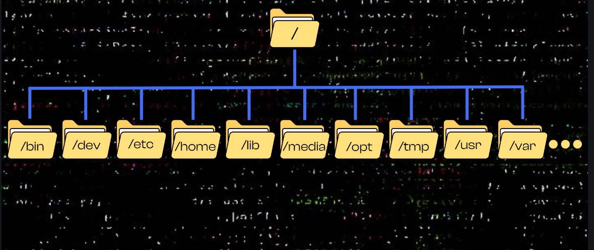

Linux:

`/home ` : user specific data are stored. 
`/`: ROOT. Everything is a file. every linux file and directories are generated from a branch of the root
The superuser - also known as root- , has full control over the entire system and this includes unrestricted access to all the files and directories on the computer.
`/bin`: binary, contains essential system programs and commands that are required for basic operation on this system
`/dev`: I/O, hardware, USB, Sensors devices and this is the directory that contains special files which represent hardware components that are connected to your system to your PC.
`/etc`: editable text configuration, configuation files, network settings. 
`/opt`: optional, additional software and applications. 
`/usr`: User system resources, user-related programs and libraries
`/var`: variable, variable data e.g. , logs, cache or datababes
`/lib`: shared libraries that are needed to run essential system programs.
`/tmp`: Temporary, stores temporary files that are cleared after reboot. accessible to all users.
`/media`....

# filesystem
- pwd : cprint working directory, start from the root
- cd : change directory
- cd .. : go to previous directory
- ls : list to current directories items
- ls -l : display with permissions
- ls -a : show unseen folder starts with dot.
- ls -la: more detailed show
- mkdir : make directory
- mkdir -p new_folder/new_folder : create nested directory
- touch filename : create file
- rm filename: delete a file
- rm -r folder : delete folder

copy a file
- touch file1.txt
- cp file1.txt file2.txt
or 
- cp file1.txt <directory we want to cp>

copy a folder 
- mkdir folder1
- cp -r folder1/ folder2
or 
- cp folder1 <specified directory>

sudo dpkg -i <>.deb
dpkg -l : list installed packages
apt-cache search python3
sudo apt remove <packages> : packages and vlc
in /etc/apt folder we can see sources.list and sources.list.d

ppa is a custom repository
apt-cache search boot-repair
sudo add-apt-repository [address]
new ppa address added manually in sources.list.d

-----
edit the text file:
in linux everything is a file. this is a cornerstone of the UNIX and LINUX design philosophy. for instance info about the CPU can read from /proc/cpuinfo. serial port is communication with other connected hardware with USB devices. and it can be read from /dev/ttyUSB0 etc...

every command line program is automatically connected to three fundamental data channels. Standard data streams abstract way for programs communicte with their environment.
stdin : it can be keyboard or other programs output.
stdout : it can be terminal or other programs input
stderr : diagnostic informations about the program.

vim, nano, gedit.

touch filename.txt

vim filename.txt

to edit a file press enter the insert mode.

to save and exit press first ESC to exit from the insert mode. then type a command starts with a column `:` and then you can decide what you want to do. for write and quit :wq and press enter.

nano filename.txt 
for save press ctrl+s or ctrl+o(type filename)
for quit ctrl+x

gedit filename.txt
graphical text editor openned and not required any command only save and close.
if you close it without save, the changes not apply. so type for background process:
gedit filename.txt &

echo "Hello from echo" > filename.txt
if filename.txt is created before for avoid overwriting use
echo "hello from echo" >> filename.txt

cat filename.txt

head filename.txt : show the first 10 line default
head -n 5 filename.txt : print first 5 line

----
files and permissions
in many operating systems are files extension like .txt .png
after dot is defines the identity of the files. 
